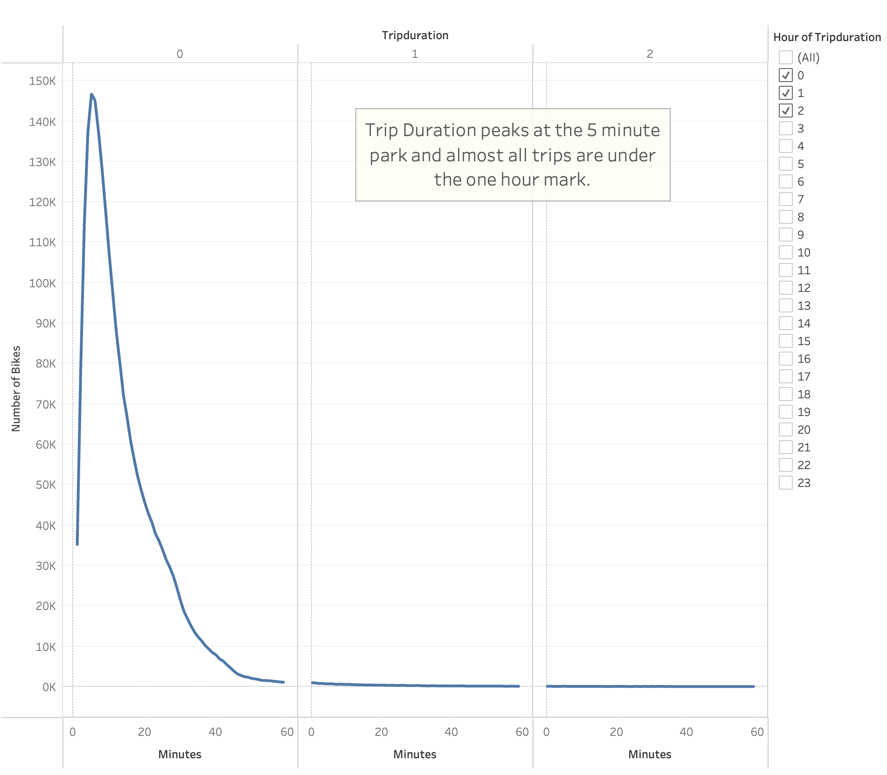

# bikesharing

### [Link to Tableau Analysis](https://public.tableau.com/shared/25QWM8R34?:display_count=n&:origin=viz_share_link)

## Overview of the analysis:
The purpose of this analysis is to view the data trends for the Citibike program in New York in order to help create an informed recommendation for setting up a similar program in another urban area.

## Results:
1) The Bike usage data trends follow business hour and rush hour trends across weekdays and hours.

2) Men use the bike share prgram significantly more than women.

3) Starting Locations correlate to population density.

Top Starting Locations for Citibikes

Bike Usage By Hour

Bike Usage By Hour and By Weekday

Bike Usage By Hour and Weekday Split by Gender (please refer to Tableau link at the top to see the full image)

One takeaway from this is that if we do not provide a strong infrastructure solution from the beginning to keep bikes available at these times in these locations, we will be losing a lot of first-time customers.

Usage split by Subscribers and Customers

Trip Duration

Trip Duration By Gender

## Summary:
We can conclude with this study that the most significant times and locations to provide bikes are rush hour business and tourist areas.

One additional visualization that I would perform would be adding a "subscriber / customer" layer to the trip durations. This would let us see how to target our marketting. (Are subsribers taking shorter trips, and are tourists and visitors taking more leisurely long trips?)

Another takeaway is that we need to research more into why women do not use the program as much as men. Are there any problems that we can address from the beginning to make this service more attractive to women?

Another additional visualization I would perform would be adding a "subscriber / customer" layer to the starting locations map. Is there any geographical difference between the subscriber and customer? This may help us in determining where our advertising targets are put up around the city.

